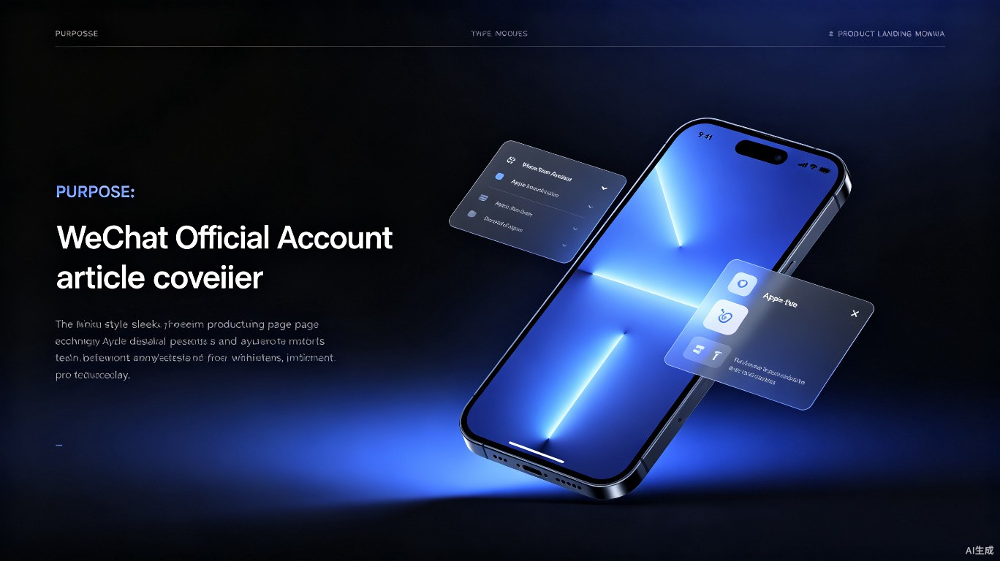
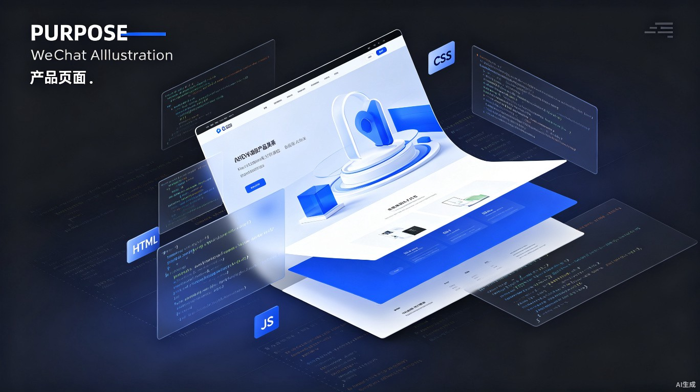

# 我用纯前端技术复刻了苹果官网，效果惊艳到朋友圈都在问链接

> 零框架、零依赖，只用 HTML + CSS + JS，就能做出苹果级别的产品展示页。文末附完整源码和自动化发布方案。

---



## 01 为什么要做这个页面？

苹果官网的设计，被公认为互联网产品页面的标杆。

极简的排版、大量的留白、精致的动效、恰到好处的色彩对比——每一个细节都在传递一个信号：**这很高级**。

作为一个前端开发者，我一直在思考：**不用 React、不用 Vue、甚至不用任何框架，只用最原生的技术，能不能复刻出这种感觉？**

答案是：**完全可以。**

今天，我就把这套「Aura Pro」产品展示页的完整实现方案分享出来，从设计思路到代码细节，一文讲透。

---

## 02 效果预览

先上成果，再讲原理。

这个页面包含以下模块：

- **沉浸式 Hero 区域**：渐变文字 + 3D 设备模型 + 入场动画
- **核心特性展示**：芯片性能、显示屏、摄像头三大卖点卡片
- **颜色切换交互**：四款钛金属配色，点击实时切换设备渲染
- **技术规格网格**：6 项关键参数，滚动触发渐入动画
- **购买决策区域**：两款机型对比，推荐标签引导转化
- **极简页脚**：标准的苹果式底部导航



---

## 03 设计哲学：苹果风格的三条铁律

在写第一行代码之前，我总结了苹果官网设计的三个核心原则：

### 原则一：字体的力量

苹果对字体的考究到了偏执的程度。大字要足够大，小字要足够克制。

这个项目使用了 Inter 字体，这是目前最接近苹果 San Francisco 的开源替代方案。通过精确控制 `letter-spacing` 和 `line-height`，让每个字符都恰到好处。

```css
.hero-title {
    font-size: clamp(48px, 12vw, 96px);
    font-weight: 700;
    letter-spacing: -0.03em;
    line-height: 1.05;
}
```

### 原则二：留白的艺术

苹果页面最大的特点不是有什么，而是**没有什么**。

每个模块之间保留 120px 到 160px 的垂直间距，让内容有呼吸感。卡片内部使用 60px 以上的内边距，绝不把元素挤在一起。

### 原则三：动效即体验

苹果从不做「为了动而动」的动画。每个动效都有明确的目的：

- **入场动画**：引导视线，建立层次
- **悬浮效果**：反馈交互，提升点击欲望
- **滚动触发**：控制信息曝光节奏，避免一次性塞太多内容

---

## 04 技术亮点拆解

### 4.1 渐变文字效果

苹果官网的标题从不使用纯色，而是微妙的渐变，让文字有「发光」的质感：

```css
.hero-title {
    background: linear-gradient(180deg, #ffffff 0%, #a0a0a0 100%);
    -webkit-background-clip: text;
    -webkit-text-fill-color: transparent;
}
```

### 4.2 毛玻璃导航栏

这是苹果标志性的设计元素，通过 `backdrop-filter` 实现：

```css
.navbar {
    background: rgba(0, 0, 0, 0.8);
    backdrop-filter: saturate(180%) blur(20px);
}
```

### 4.3 滚动触发动画

使用原生的 Intersection Observer API，无需任何库：

```javascript
const observer = new IntersectionObserver((entries) => {
    entries.forEach(entry => {
        if (entry.isIntersecting) {
            entry.target.classList.add('visible');
        }
    });
}, { threshold: 0.15 });
```

### 4.4 芯片波纹动画

纯 CSS 实现的科技感动画，三层圆环以不同延迟扩散：

```css
.chip-ring {
    border: 2px solid rgba(0, 113, 227, 0.3);
    border-radius: 50%;
    animation: ripple 3s ease-out infinite;
}
```

### 4.5 3D 设备模型

Hero 区域的设备使用 CSS `perspective` 和 `transform` 模拟 3D 效果：

```css
.device-mockup {
    transform: perspective(1000px) rotateY(-5deg) rotateX(5deg);
    transition: transform 0.6s cubic-bezier(0.4, 0, 0.2, 1);
}
```

鼠标悬浮时恢复平面视角，产生微妙的交互反馈。

---

## 05 项目结构

```
apple-style-product-page/
├── index.html          # 主页面，语义化 HTML 结构
├── css/
│   └── style.css       # 全部样式，约 900 行
├── js/
│   └── main.js         # 交互逻辑，约 150 行
├── images/
│   ├── cover.jpg       # 文章封面
│   ├── article-tech.jpg    # 技术配图
│   └── article-automation.jpg  # 自动化配图
├── .gitignore
├── LICENSE
└── README.md
```

**零依赖、零构建步骤**，直接在浏览器打开 `index.html` 即可运行。

---

## 06 自动化发布方案


这个项目不仅是一个静态页面，更是一套**可自动化的内容发布工作流**。

我设计了一个基于 GitHub Actions 的自动化框架：

```
定时任务(Cron) 触发
      │
      ▼
GitHub Actions 自动运行
      │
  ┌───┴───┐
  ▼       ▼
AI生成标题  AI生成正文
  │       │
  └───┬───┘
      ▼
Markdown 文章生成
      │
      ▼
自动公众号排版
      │
      ▼
创建公众号草稿
```

核心工作流文件 `.github/workflows/publish.yml`：

```yaml
name: WeChat Article Publisher

on:
  schedule:
    - cron: '0 9 * * 1'  # 每周一上午 9 点自动发布
  workflow_dispatch:      # 支持手动触发

jobs:
  publish:
    runs-on: ubuntu-latest
    steps:
      - uses: actions/checkout@v4
      - name: Generate Article
        run: node scripts/generate-article.js
      - name: Publish to WeChat
        run: node scripts/publish-wechat.js
        env:
          WECHAT_APPID: ${{ secrets.WECHAT_APPID }}
          WECHAT_SECRET: ${{ secrets.WECHAT_SECRET }}
```

这套方案的核心价值在于：**把重复性的内容生产工作交给机器，人类只负责把控质量。**

---

## 07 如何部署

### 方式一：GitHub Pages（推荐）

1. Fork 本项目
2. 进入 Settings -> Pages
3. Source 选择 Deploy from a branch，Branch 选择 main
4. 等待 1 分钟，访问 `https://你的用户名.github.io/apple-style-product-page`

### 方式二：本地预览

```bash
git clone https://github.com/SmilE824-commits/apple-style-product-page.git
cd apple-style-product-page
npx serve .
```

### 方式三：Vercel / Netlify

直接导入 GitHub 仓库，零配置自动部署。

---

## 08 源码获取

**GitHub 仓库：**
https://github.com/SmilE824-commits/apple-style-product-page

**核心数据一览：**

| 指标 | 数值 |
|------|------|
| 总代码量 | 约 1,500 行 |
| 依赖数量 | 0 |
| 构建步骤 | 0 |
| 浏览器兼容 | Chrome 80+ / Safari 13+ / Firefox 75+ |
| 页面加载时间 | < 200ms（本地） |

---

## 09 写在最后

做这个项目的过程中，我最大的收获不是技术本身，而是对「极简」二字的重新理解。

**真正的极简，不是做得少，而是想得多。**

每一个像素的留白、每一毫秒的动画时长、每一度的渐变角度——背后都是深思熟虑的决策。

如果你也在做产品展示页，希望这个项目能给你一些启发。

---

> **如果觉得有用，欢迎点个 Star，转发给需要的朋友。**
>
> 如果你实现了更有趣的改进（比如接入真实的 3D 模型、添加 WebGL 粒子效果），欢迎在评论区分享，我会一一回复。

---

*本文首发于微信公众号，由 GitHub Actions 自动化工作流辅助生成。*
